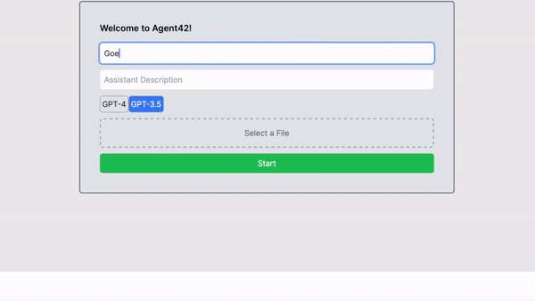

# OpenAI Assistant API Chat

## Introduction

Welcome to the OpenAI Assistant API Chat repository! This innovative chat application allows users to interact with an AI assistant powered by OpenAI's latest "gpt-4-1106-preview" model. It's an exciting space where technology meets conversation, offering a unique experience of AI interaction.


# Demo
In the demo, you can see the AI assistant in action.
[LIVE DEMO](https://open-ai-assistant-api-chat.vercel.app)


# File Upload


## Features

- **Personalized AI Assistant**: Customize the assistant's name, model, and description for a unique chat experience.
- **Interactive Chat Experience**: Engage in dynamic conversations with the AI assistant.
- **Robust AI Responses**: Leveraging OpenAI's "gpt-4-1106-preview" model for intelligent, context-aware chat responses.
- **File Upload**: Users can upload files for the assistant to analyze.
- **Code Interpretation**: (Coming Soon) The assistant can execute Pytho code.
- **Function Calls**: (Coming Soon) Experience interactive functionalities such as API calls based on chat context.
- **GPT-4 Vision Integration**: (Coming Soon) 
   - **Image Descriptions**: Send pictures to the AI, and it will describe what it sees, providing insights and understanding of the visual content.
   - **Optical Character Recognition (OCR)**: The AI can analyze text within images, making it possible to read and respond to textual content in photographs or scanned documents.

# Image Upload



#For Developer

[GPT4-Vision api router ](https://github.com/admineral/OpenAI-Assistant-API-Chat/tree/main/app/api/upload_gpt4v/route.ts)


## Beta & Work in Progress

Please note that this application is currently in the beta phase and is continuously evolving. We are working diligently to enhance the user experience and add new features. During this phase, you may encounter some hiccups or unexpected behavior.


## Getting Started

### Prerequisites
- Node.js installed on your machine.
- An active OpenAI API key.

### Installation
1. **Clone the Repository**:
   ```
   git clone https://github.com/your-username/openai-assistant-chat.git
   ```
2. **Install Dependencies**:
   Navigate to the project directory and run:
   ```
   npm install
   ```
3. **Environment Setup**:
   Create a `.env` file in the root directory and add your OpenAI API key:
   ```
   OPENAI_API_KEY=your_openai_api_key
   ```
4. **Run the Application**:
   Start the server with:
   ```
   npm run dev
   ```

## Contributing

Your contributions make this project thrive. Whether it's reporting bugs, suggesting features, or submitting code changes, every bit of help is greatly appreciated. 

- **Report Issues**: If you encounter any problems, please open an issue on our GitHub page.
- **Feature Requests**: Have an idea? Share it with us by opening an issue.
- **Pull Requests**: Want to make a direct impact? Fork the repository, make your changes, and submit a pull request.

We look forward to growing this project with the community's support and creativity!


# Code Explanation (for Developers)

app/page.tsx - Main Component

Chat Component: This is where the chat interface and interactions are managed. It's the heart of the application, allowing users to engage with the AI assistant.
startAssistant() - Assistant Initialization

Function Role: This crucial function initiates the AI assistant. It handles file uploads, assistant creation, thread management, and oversees the assistant's running status.
Key Steps:
Validates required fields (name, model, description, message).
Manages file processing, converting images to text descriptions if needed.
Handles file uploads and uses this data to create an assistant and a chat thread.
Checks the status of the assistant's execution, ensuring it completes successfully.
handleFormSubmit() - Message Handling

Purpose: Manages user message submissions, sending them to the API and updating the chat interface.
Process:
Adds user messages to the chat.
Communicates with the API to process the message, run the assistant, and fetch responses.
Updates the chat interface with the assistant's responses.
app/services/api.js - API Calls

uploadImageAndGetDescription(): Uploads an image and retrieves its description.
uploadFile(): Manages file uploading.
createAssistant(): Creates an AI assistant instance with specific configurations.
app/api/upload/route.ts - File Upload API Route

Functionality: Handles file uploads necessary for starting chat sessions with the OpenAI API.
app/api/listMessages/route.ts - List Messages API Route

Purpose: Retrieves messages from a chat thread, allowing for a continuous chat flow.
app/hooks/useChatState.ts - Chat State Management

Role: A custom hook that maintains the chat state, managing variables like assistant details, chat status, and user inputs.
app/components/MessageList.js - Message Display Component

Function: Displays chat messages in a user-friendly format, differentiating between user and assistant messages.
Code Flow Explanation
app/page.tsx - startAssistant()

Flow:
Validates input data.
Sets up the environment for the chat assistant.
Manages file processing and uploads.
Creates an assistant and initiates a chat thread.
Monitors and updates the assistant's running status.
Retrieves and displays chat messages.
handleFormSubmit() - User Interaction

Process:
User's input is added to the chat.
The message is processed through various API calls.
Assistant's response is fetched and displayed.
app/hooks/useChatState.ts - State Management

Details: Manages various state elements like assistant configuration, chat status, and message handling, ensuring a dynamic and responsive chat interface.
app/components/WelcomeForm.js - Assistant Initialization Form

Description: Presents a user-friendly form for initializing the chat assistant, handling inputs like assistant name, model, and file selection.
app/components/InputForm.js - Message Input Form

Functionality: Allows users to input their messages and submit them for processing, integrating smoothly with the chat interface.
app/components/MessageList.js - Message Display

Role: Effectively displays the chat messages, enhancing the user experience by visually distinguishing between user and assistant messages.


# Code Explanation for `app/page.tsx` in TypeScript and React

## Overview
The file `app/page.tsx` is a core part of the application, primarily written in TypeScript and React. It includes the main `Chat` component and several functions and hooks for handling the chat interface and interactions with an AI assistant.

### `Chat` Component
```tsx
export default function Chat() {
  // ... Component logic
}
```
- **Purpose**: The `Chat` component is the main component of the application. It orchestrates the chat interface, handling user interactions and displaying chat messages.
- **Key Features**:
  - Manages chat state using custom hooks.
  - Handles file inputs for initiating the assistant.
  - Triggers assistant-related functions like `startAssistant` and `handleFormSubmit`.

### `startAssistant` Function
```tsx
async function startAssistant() {
  // ... Function logic
}
```
- **Purpose**: This function initiates the chat assistant. It involves multiple steps like uploading a file, creating an assistant, starting a chat thread, and managing the assistant's run status.
- **Process Flow**:
  1. **Validation**: Checks if necessary fields are filled.
  2. **Status Update**: Sets various status messages throughout the process.
  3. **File Handling**: Handles file uploads and processes images for description.
  4. **Assistant and Thread Creation**: Creates an assistant and a chat thread.
  5. **Running the Assistant**: Starts the assistant and monitors its status.
  6. **Message Retrieval**: Fetches messages from the thread to display in the chat.

### `handleFormSubmit` Function
```tsx
const handleFormSubmit = async (e: any) => {
  // ... Function logic
}
```
- **Purpose**: Manages the submission of the chat form. It sends user messages to the assistant and updates the chat with the assistant's responses.
- **Process Flow**:
  1. **Message Addition**: Adds the user's message to chat.
  2. **API Interactions**: Communicates with various API endpoints for sending and receiving messages.
  3. **Chat Update**: Updates the chat interface with new messages.

### Custom Hook: `useChatState`
```tsx
export const useChatState = () => {
  // ... Hook logic
}
```
- **Purpose**: Manages the chat's state, including variables like the assistant's details, chat messages, and UI-related states.
- **Key States Managed**: Includes states for assistant details (name, model, description), chat messages, file data, loading and disabled states, and more.

### Key Components:
- **`WelcomeForm`**: A form component for initializing the assistant.
- **`InputForm`**: A form for the user to input their messages.
- **`MessageList`**: Displays the list of chat messages.

### File Structure and Interaction
- **Services and API Calls**: `app/services/api.js` includes API functions like `uploadImageAndGetDescription`, `uploadFile`, and `createAssistant`.
- **API Routes**: Includes routes like `app/api/upload/route.ts` and `app/api/listMessages/route.ts` for handling file uploads and message listing.
- **Components Interaction**: The `Chat` component uses `WelcomeForm`, `InputForm`, and `MessageList` to build the user interface.

### Conclusion
This TypeScript and React code in `app/page.tsx` plays a crucial role in the application by managing the main chat interface, interacting with the backend for data processing, and providing a seamless user experience.


# Comprehensive Code Explanation for the TypeScript and React Application

## Overview
This application, primarily developed in TypeScript and React, features a chat interface that interacts with an AI assistant. It includes various components, functions, and services that handle the user interface, data processing, and API interactions.

### `app/page.tsx`: Main Chat Component
- **Functionality**: Serves as the primary interface for the chat application.
- **Key Elements**:
  - **`Chat` Component**: Orchestrates the entire chat interface.
  - **`startAssistant` Function**: Initializes the chat assistant, managing file uploads and assistant interactions.
  - **`handleFormSubmit` Function**: Handles sending user messages and displaying assistant responses.
  - **Custom Hook (`useChatState`)**: Manages state variables for the chat, including assistant details and chat messages.
  - **Sub-Components**: Includes `WelcomeForm` for initial setup, `InputForm` for message input, and `MessageList` for displaying chat messages.

### `app/services/api.js`: API Service Functions
- **Functionality**: Contains functions for various API interactions.
- **Key Functions**:
  - **`uploadImageAndGetDescription`**: Uploads an image and retrieves a description.
  - **`uploadFile`**: Handles file uploads.
  - **`createAssistant`**: Creates an AI assistant instance.
  - Other functions for managing chat threads and assistant interactions.

### API Routes
- **`app/api/upload/route.ts`**: Manages the uploading of files necessary for initiating chat sessions.
- **`app/api/listMessages/route.ts`**: Retrieves messages from a specific chat thread.

### Custom Hooks
- **`useChatState.ts`**: Manages the chat state, including user inputs, chat messages, and UI states.

### React Components
- **`MessageList.js`**: Displays chat messages in a user-friendly format.
- **`WelcomeForm.js`**: Initial setup form for the assistant.
- **`InputForm.js`**: Form for user message input.

### Functional Flow
1. **Initialization (WelcomeForm)**: User inputs details and initiates the assistant.
2. **Assistant Setup (`startAssistant`)**: The assistant is set up, including file uploads and thread creation.
3. **Message Handling (`handleFormSubmit`)**: User messages are sent, and responses are fetched and displayed.
4. **State Management (`useChatState`)**: Maintains the overall state of the chat, including messages and statuses.
5. **API Interactions (`api.js` Services)**: Communicate with backend services for various functionalities like uploading files, creating assistants, and fetching messages.
6. **User Interface**: The `Chat` component integrates various sub-components and custom hooks to provide an interactive chat interface.

### Conclusion
Overall, this application exemplifies a well-structured React and TypeScript project, incorporating efficient state management, API interactions, and a user-centric interface. Each part of the codebase contributes to a seamless chat experience with an AI assistant, showcasing modern web development practices.