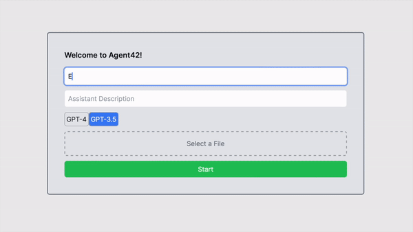

# Code Refactor 90% done. ----> Branch ---> Code_refactor 


# OpenAI Assistant API Chat

[](https://vercel.com/new/clone?repository-url=https%3A%2F%2Fgithub.com%2Fadmineral%2FOpenAI-Assistant-API-Chat&env=OPENAI_API_KEY&envDescription=OpenAI%20API%20Key&envLink=https%3A%2F%2Fplatform.openai.com%2Faccount%2Fapi-keys&project-name=openai-assistant-api-chat&repository-name=OpenAI-Assistant-API-Chat)
[](https://open-ai-assistant-api-chat.vercel.app)

## Introduction

Welcome to the OpenAI Assistant API Chat repository! This innovative chat application allows users to interact with an AI assistant powered by OpenAI's latest "gpt-4-1106-preview" model. It's an exciting space where technology meets conversation, offering a unique experience of AI interaction.

# [Demo](https://open-ai-assistant-api-chat.vercel.app)



## Beta & Work in Progress

Please note that this application is currently in the beta phase and is continuously evolving. We are working diligently to enhance the user experience and add new features. During this phase, you may encounter some hiccups or unexpected behavior.

## Deployment

This application is ready to be deployed with Vercel, a cloud platform for static sites and Serverless Functions. Vercel provides an easy way to deploy your applications directly from your repository.

To deploy this application with Vercel, click on the "Deploy with Vercel" button below. This will take you to the Vercel platform where you'll be guided through the deployment process.

Please note that you'll need to provide your OpenAI API key during the deployment process. This key is used to authenticate your application's requests to the OpenAI API.

[](https://vercel.com/new/clone?repository-url=https%3A%2F%2Fgithub.com%2Fadmineral%2FOpenAI-Assistant-API-Chat&env=OPENAI_API_KEY&envDescription=OpenAI%20API%20Key&envLink=https%3A%2F%2Fplatform.openai.com%2Faccount%2Fapi-keys&project-name=openai-assistant-api-chat&repository-name=OpenAI-Assistant-API-Chat)


In addition to the OpenAI API key, you can also specify a default Assistant ID during the deployment process. This ID determines which AI assistant is used in the chat application. If you set this ID, the application will use this assistant for the chat. If you do not set this ID, the application will prompt the user to enter the assistant details.

To deploy the application with both the OpenAI API key and a hardcoded Assistant ID, click on the "Deploy with Vercel" button below. You will be prompted to enter both your OpenAI API key and your Assistant ID.

[](https://vercel.com/new/clone?repository-url=https%3A%2F%2Fgithub.com%2Fadmineral%2FOpenAI-Assistant-API-Chat&env=OPENAI_API_KEY,REACT_APP_ASSISTANT_ID&envDescription=OpenAI%20API%20Key,Assistant%20ID&envLink=https%3A%2F%2Fplatform.openai.com%2Faccount%2Fapi-keys&project-name=openai-assistant-api-chat&repository-name=OpenAI-Assistant-API-Chat)
## Features

- **Personalized AI Assistant**: Customize the assistant's name, model, and description for a unique chat experience.
- **Interactive Chat Experience**: Engage in dynamic conversations with the AI assistant.
- **Robust AI Responses**: Leveraging OpenAI's "gpt-4-1106-preview" model (128k context) for intelligent, context-aware chat responses.
- **File Upload**: Users can upload files for the assistant to analyze.
- **GPT-4 Vision Integration**: Send pictures to the AI, and it will describe what it sees, providing insights and understanding of the visual content.(improoved version soon)


- **Function Calls**: (Coming Soon) Experience interactive functionalities such as API calls based on chat context.
- **Code Interpretation**: (Coming Soon) The assistant can execute Pytho code.


## Getting Started

### Prerequisites
- Node.js installed on your machine.
- An active OpenAI API key.

### Installation
1. **Clone the Repository**:
   ```
   git clone https://github.com/admineral/OpenAI-Assistant-API-Chat.git
   ```
2. **Install Dependencies**:
   Navigate to the project directory and run:
   ```
   npm install
   ```
3. **Environment Setup**:
   Create a `.env` file in the root directory and add your OpenAI API key:
   ```
   OPENAI_API_KEY=your_openai_api_key
   ```
4. **Run the Application**:
   Start the server with:
   ```
   npm run dev
   ```

## Contributing

Your contributions make this project thrive. Whether it's reporting bugs, suggesting features, or submitting code changes, every bit of help is greatly appreciated. 

- **Report Issues**: If you encounter any problems, please open an issue on our GitHub page.
- **Feature Requests**: Have an idea? Share it with us by opening an issue.
- **Pull Requests**: Want to make a direct impact? Fork the repository, make your changes, and submit a pull request.

We look forward to growing this project with the community's support and creativity!


## Application Architecture Overview

### ChatManager (`ChatManager.ts`)
- **Role**: Central component for managing chat state and operations.
- **Functions**:
  - `startAssistant`: Initializes the chat assistant, manages file uploads, and handles thread creation.
  - `sendMessage`: Sends user messages to the assistant and updates the chat.
  - `getChatState`: Retrieves the current state of the chat, including messages and assistant status.

### API Layer (`api.js`)
- **Purpose**: Acts as an intermediary between the front-end and various API routes.
- **Key Functions**:
  - `uploadImageAndGetDescription`: Uploads images and gets descriptions using the GPT-4 Vision API.
  - `createAssistant`, `createThread`, `runAssistant`: Handles assistant creation, thread management, and assistant operations.

### Assistant Modules (`assistantModules.ts`)
- **Role**: Manages tasks related to the chat assistant, such as file preparation and assistant initialization.
- **Key Functions**:
  - `prepareUploadFile`: Prepares and uploads files for the chat assistant.
  - `initializeAssistant`: Initializes a chat assistant with specific details.
  - `createChatThread`: Creates a chat thread with an initial message.

### Chat Modules (`chatModules.ts`)
- **Purpose**: Manages chat-related functionalities.
- **Key Functions**:
  - `submitUserMessage`: Submits user messages to the chat.
  - `fetchAssistantResponse`: Fetches the latest messages from the assistant.
  - `updateChatState`: Updates the chat state with new messages.


## Detailed Code Explanation

### ChatManager Implementation (`ChatManager.ts`)
- **Singleton Pattern**: Ensures a single instance of `ChatManager` manages the chat state and operations.
- **State Management**: Handles chat state, including messages, thread IDs, assistant status, and loading states.
- **Error Handling**: Robust error handling during chat operations.
- **API Integration**: Integrates with API layer for message sending/receiving and chat thread management.

### API Layer (`api.js`)
- **Central API Management**: Simplifies front-end interactions with a clean API interface.
- **Error Handling**: Ensures smooth application operation with error handling in API requests.

### Front-End Interaction
- **React Hooks**: Utilizes hooks in `useChatState.ts` for state management.
- **User Interface**: `InputForm` and `MessageList` interact with `ChatManager` for displaying messages and handling user inputs.


### Main Components and Flow
- **ChatManager (`ChatManager.ts`)**: Central component managing the chat state and operations.
- **API Layer (`api.js`)**: Intermediary for API interactions.
- **Assistant Modules (`assistantModules.ts`)**: Handles tasks related to the chat assistant.
- **Chat Modules (`chatModules.ts`)**: Manages chat functionalities.

## Detailed Breakdown

### `ChatManager.ts`
This is the core class managing the chat's state and operations.

```typescript
class ChatManager {
  private state: ChatState;
  private static instance: ChatManager | null = null;

  // Singleton pattern to ensure a single ChatManager instance
  private constructor(setChatMessages: (messages: any[]) => void, setStatusMessage: (message: string) => void) {
    this.state = {
      /* State initialization */
    };
    console.log('ChatManager initialized');
  }

  // Method to get the current instance of ChatManager
  public static getInstance(setChatMessages: (messages: any[]) => void, setStatusMessage: (message: string) => void): ChatManager {
    if (this.instance === null) {
      this.instance = new ChatManager(setChatMessages, setStatusMessage);
    }
    return this.instance;
  }

  // Method to start the assistant
  async startAssistant(assistantDetails: any, file: File | null, initialMessage: string): Promise<void> {
    // ... Function logic including API calls to initialize assistant and create chat thread
  }

  // Method to send a message
  async sendMessage(input: string): Promise<void> {
    // ... Function logic to handle message sending
  }

  // Method to get the current chat state
  getChatState(): ChatState {
    console.log('Getting chat state');
    return this.state;
  }
}
```
- **Key Features**:
  - Singleton pattern ensures only one instance of `ChatManager` is created.
  - Manages the chat's state, including messages, assistant's ID, thread ID, and loading states.
  - `startAssistant`: Initiates the assistant and sets up the chat thread.
  - `sendMessage`: Handles sending messages to the assistant.
  - `getChatState`: Retrieves the current state of the chat.

### `api.js`
This module contains functions for various API interactions required by the chat application.

```javascript
// Example of an API function
export const uploadImageAndGetDescription = async (base64Image) => {
  // Code to upload an image and get a description using the OpenAI API
};

export const createAssistant = async (assistantDetails) => {
  // Code to create an assistant
};

// Other API functions like 'createThread', 'runAssistant', etc.
```
- **Purpose**: Provides a centralized and clean interface for API interactions.
- **Key Functions**:
  - `uploadImageAndGetDescription`: Uploads a base64 encoded image and gets a description.
  - `createAssistant`: Creates a new assistant instance.
  - Other functions for managing threads, running assistants, etc.

### `assistantModules.ts`
Contains functions related to preparing and managing the chat assistant.

```typescript
export const prepareUploadFile = async (file: File, setStatusMessage: (message: string) => void): Promise<string> => {
  // Logic to prepare and upload a file for the chat assistant
};

export const initializeAssistant = async (assistantDetails, fileId): Promise<string> => {
  // Logic to initialize an assistant with given details
};

export const createChatThread = async (inputMessage: string): Promise<string> => {
  // Logic to create a chat thread
};
```
- **Purpose**: Handles assistant-related tasks such as file preparation and assistant initialization.

### `chatModules.ts`
Manages chat-related functionalities, primarily dealing with messages.

```typescript
export const submitUserMessage = async (input: string, threadId: string): Promise<void> => {
  // Logic to submit a user's message to the chat
};

export const fetchAssistantResponse = async (runId: string, threadId: string): Promise<string> => {
  // Logic to fetch the latest messages from the assistant
};

export const updateChatState = (prevMessages: Message[], newMessages: Message[], setChatMessages: (messages: any[]) => void): Promise<void> => {
  // Logic to update the chat state with new messages
};
```
- **Purpose**: Manages sending user messages, fetching assistant responses, and updating the chat state.

### React Components
- **`WelcomeForm`**, **`InputForm`**, and **`MessageList`** are React components that build the user interface of the chat application.

 They use hooks and states to manage user interactions and display chat messages.

### API Routes (`/api/*.ts`)
These files define various API routes for handling tasks like creating assistants, listing messages, checking run status, etc. They interact with the OpenAI API and provide endpoints for the frontend to call.

