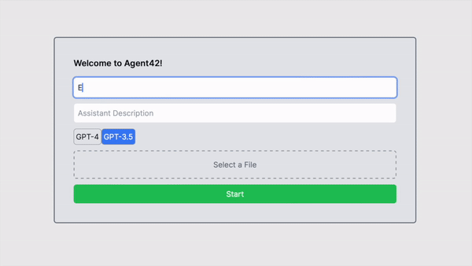

# Code Refactor 90% done. ----> Branch ---> Code_refactor 


# OpenAI Assistant API Chat

[](https://vercel.com/new/clone?repository-url=https%3A%2F%2Fgithub.com%2Fadmineral%2FOpenAI-Assistant-API-Chat&env=OPENAI_API_KEY&envDescription=OpenAI%20API%20Key&envLink=https%3A%2F%2Fplatform.openai.com%2Faccount%2Fapi-keys&project-name=openai-assistant-api-chat&repository-name=OpenAI-Assistant-API-Chat)
[](https://open-ai-assistant-api-chat.vercel.app)

## Introduction

Welcome to the OpenAI Assistant API Chat repository! This innovative chat application allows users to interact with an AI assistant powered by OpenAI's latest "gpt-4-1106-preview" model. It's an exciting space where technology meets conversation, offering a unique experience of AI interaction.

# [Demo](https://open-ai-assistant-api-chat.vercel.app)



Here’s a **beginner-friendly rewrite** of your GitHub README. The goal is to keep the technical accuracy but make it easier to understand for developers who are newer to the project or the tech stack.

---

## 🚧 Beta Notice

This app is still in **beta** – it's working, but we’re actively improving it. Expect some bugs or missing features. Contributions are welcome!

---

## 🌐 Deploy It Yourself (Vercel)

You can easily deploy this app using [**Vercel**](https://vercel.com/), a platform for hosting web apps.

### ✅ What you’ll need:

* A **free Vercel account**
* Your **OpenAI API key**
* (Optional) A default **Assistant ID** if you already created one

### 🛠️ How to deploy:

1. Click the button below:

   > [](https://vercel.com/import/project?template=https://github.com/admineral/OpenAI-Assistant-API-Chat)

2. Follow the setup steps.

3. When asked, enter:

   * `OPENAI_API_KEY` → Get it from [https://platform.openai.com/](https://platform.openai.com/)
   * `ASSISTANT_ID` (optional) → If not set, the app will prompt users to enter it.

---

## ✨ Features

✅ **Customizable AI Assistant**
✅ **Dynamic Chat UI**
✅ **GPT-4 128k Context** Support
✅ **File Uploads** – Send PDFs, images, etc. to the assistant
✅ **GPT-4 Vision** – Image input and description
🛠️ **Coming Soon:**

* Code Execution (Python)
* Function Calling (API integration)

---

## 🧰 Getting Started (Local Setup)

### 🔗 Prerequisites

* Node.js installed
* An OpenAI API key

### 📦 Installation Steps

```bash
# 1. Clone the repo
git clone https://github.com/admineral/OpenAI-Assistant-API-Chat.git

# 2. Go into the project folder
cd OpenAI-Assistant-API-Chat

# 3. Install dependencies
npm install

# 4. Set your OpenAI API key
echo "OPENAI_API_KEY=your_key_here" > .env

# 5. Run the app
npm run dev
```

The app will start on `http://localhost:3000`

---

## 🧑‍💻 Contributing

We love community contributions! Here's how you can help:

* **🐛 Report bugs**: [Open an issue](https://github.com/admineral/OpenAI-Assistant-API-Chat/issues)
* **💡 Suggest features**
* **📤 Submit code**: Fork → Make changes → Pull Request

---

## 🏗️ Architecture Overview

Here's a simplified view of how things are structured:

### 📁 `ChatManager.ts`

Main class managing chat state and logic:

* Starts the assistant
* Sends messages
* Tracks conversation state

### 📁 `api.js`

Handles communication with the OpenAI API:

* Upload images
* Create assistants and threads
* Fetch responses

### 📁 `assistantModules.ts`

Manages assistant setup:

* File preparation
* Assistant creation
* Chat thread setup

### 📁 `chatModules.ts`

Handles chat message logic:

* Sending messages
* Fetching responses
* Updating chat state

### 🧱 Frontend (React)

Components:

* `WelcomeForm`, `InputForm`, `MessageList`
* Use React hooks for chat state

### 📁 API Routes

Located in `/api/*.ts`:

* Backend endpoints to handle assistant setup and chat logic
* Bridges between frontend and OpenAI API

---

## 📌 Example Code: `ChatManager.ts`

```ts
class ChatManager {
  private static instance: ChatManager | null = null;

  private constructor(...) {
    // State setup
  }

  public static getInstance(...) {
    if (!this.instance) {
      this.instance = new ChatManager(...);
    }
    return this.instance;
  }

  async startAssistant(...) {
    // Start the assistant and create a thread
  }

  async sendMessage(...) {
    // Send message to assistant
  }

  getChatState() {
    return this.state;
  }
}
```

✅ Uses Singleton Pattern
✅ Handles messages, assistant setup, and chat thread
✅ Keeps your chat state clean and centralized

---

## 💬 Questions or Feedback?

Open an [issue](https://github.com/admineral/OpenAI-Assistant-API-Chat/issues), or start a discussion! We're building this together.
